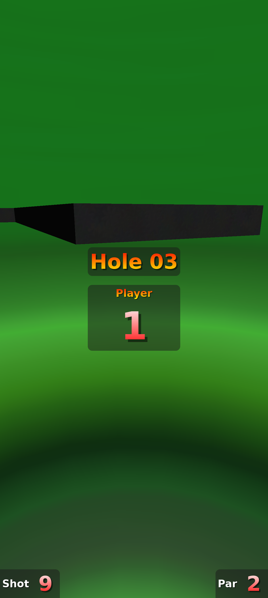

# MiniPutt Mobile

A mobile port of [Neverputt](https://github.com/Neverball/neverball), the open-source mini golf game, rebuilt for modern Android phones.



## What is this?

Neverputt is a physics-based mini golf game originally released in 2003 by Robert Kooima as part of the [Neverball](http://neverball.org/) project. It features 3D courses rendered in OpenGL where you aim and putt a ball into the hole, competing for the lowest score.

MiniPutt Mobile takes the original C engine and brings it to Android with touch controls, haptic feedback, and a modern build toolchain. This port is based on [Dmitry Rodin's Android fork](https://github.com/drodin/neverball), updated for 2026 devices.

## Features

- 8 courses with 18 holes each (144 holes total)
- Touch controls: drag to aim, tap to putt
- Haptic feedback on putts, bounces, hole-ins, and falls
- Adjustable touch sensitivity
- Runs on Android 7.0+ (API 24) with OpenGL ES
- Supports arm64-v8a and armeabi-v7a architectures

## Building from Source

### Requirements

- Android Studio (2024+)
- Android SDK 35
- Android NDK 25.1.8937393
- CMake 3.22.1

### Steps

```bash
cd android

# Copy and edit the keystore config (for release builds)
cp keystore.properties.example keystore.properties
# Edit keystore.properties with your signing key details

# Build the Neverputt debug APK
./gradlew assemblePuttPlayDebug

# Build and install to a connected device
./gradlew installPuttPlayDebug

# Release build
./gradlew assemblePuttPlayRelease
```

The first build will take a while as Hunter downloads and compiles all native dependencies (SDL2, SDL2_ttf, libvorbis, libpng, libjpeg, zlib, freetype).

### Build Flavors

The project has two dimension axes:

| Dimension | Flavor | Description |
|-----------|--------|-------------|
| version | `putt` | Neverputt (mini golf) |
| version | `ball` | Neverball (obstacle course) |
| store | `play` | Google Play build |
| store | `dapp` | Solana dApp Store build (includes wallet integration) |

So the main target is `puttPlay` (e.g., `assemblePuttPlayDebug`).

### Desktop Build (Linux/macOS)

The original Makefile still works for desktop builds:

```bash
make neverputt    # requires SDL2, SDL2_ttf, libvorbis, libpng, libjpeg, OpenGL dev libs
```

## Project Structure

```
share/          C engine: rendering (OpenGL/ES), physics, audio, input, GUI, state machine
putt/           Neverputt game logic, touch controls, HUD, state screens
ball/           Neverball game logic (included but not the primary target)
data/           Game assets: textures, maps (.map), compiled levels (.sol), music, fonts
android/        Gradle project, JNI bridge, Android activity, ad management
mapc/           Map compiler: converts .map (Radiant editor format) to .sol (binary)
po/             Translation files (gettext)
doc/            Documentation, legal notices, license texts
```

### How the Engine Works

The game uses a **state machine** pattern. Every screen (title, gameplay, pause, score) is a `struct state` with function pointers for `enter`, `leave`, `paint`, `timer`, `click`, etc. Transitions happen via `goto_state()`. State files are prefixed `st_` (e.g., `putt/st_all.c`).

3D levels use the **SOL binary format**: `.map` files (Radiant editor) are compiled by `mapc` into `.sol` files containing geometry, physics data, and entity placement. The physics simulation runs in `share/solid_sim_sol.c`.

### Android Integration

`MySDLActivity` (extends SDL's `SDLActivity`) handles the Android lifecycle. On startup it copies game data from APK assets to the app's private files directory. The C engine is compiled as a shared library (`libneverputt.so`) loaded via JNI. Additional Java-side managers handle ads (`AdManager.java`) and haptic feedback.

## Configuration

The game stores settings in `neverputt.cfg` in the app's private files directory. Key options:

| Setting | Default | Description |
|---------|---------|-------------|
| `mouse_sense` | 300 | Touch sensitivity (higher = more sensitive) |
| `haptic` | 1 | Haptic feedback on/off |
| `ad_free` | 0 | Set to 1 to disable ads |
| `ad_interval` | 3 | Holes between interstitial ads |

## AdMob Setup

The project includes AdMob ad integration. To use your own ad units:

1. Replace the placeholder AdMob Application ID in `android/app/src/main/AndroidManifest.xml`
2. Replace the placeholder ad unit IDs in `android/app/src/main/java/com/miniputt/mobile/AdManager.java`
3. See [Google AdMob docs](https://developers.google.com/admob/android/quick-start) for setup

## Credits

- **Original game**: Robert Kooima and [Neverball contributors](doc/authors.txt)
- **Android port base**: [Dmitry Rodin](https://github.com/drodin/neverball)
- **Mobile port**: MiniPutt Mobile contributors

## License

This project is licensed under the **GNU General Public License v3** (GPLv3).

The original Neverball/Neverputt is licensed under GPL v2 or later. This derivative work uses the "or later" clause to adopt GPLv3. See [LICENSE-MINIPUTT.md](LICENSE-MINIPUTT.md) for details and [doc/legal/](doc/legal/) for full license texts.

You are free to use, modify, and redistribute this software under the terms of the GPLv3. Any derivative work must also be distributed under the GPLv3 with complete corresponding source code.

## Links

- [Original Neverball project](http://neverball.org/)
- [Original source code](https://github.com/Neverball/neverball)
- [Android port base (drodin)](https://github.com/drodin/neverball)
